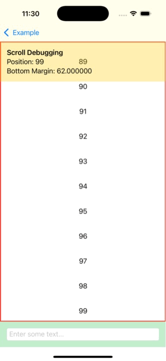
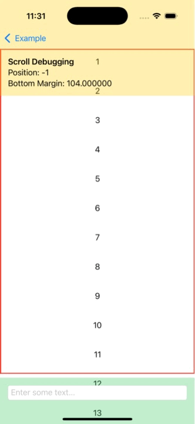

# scroll-position-example

I feel like I must be missing something when using the newer SwiftUI `scrollPosition()` modifiers. In theory, this modifier allows the tracking of the position of the scroll based on content for a given anchor point. Beyond tracking, the binding can be used to explicitly set the position for which the `ScrollView` should display.

This seems to work as expected. What doesn't seem to work though, is when used in combination with a `TextField` - either stacked with a `ScrollView` or added using the `safeAreaInset()` modifier. The `ScrollView` size and safe area are adjusted by the system due to the expansion of the `TextField`, yet the scroll position binding doesn't update as the content moves out of the content view.

Am I missing something here? Is this a bug? Should it work differently?

| Stacked Views Example                                              | Safe Area Inset Example                                             |
| ------------------------------------------------------------------ | ------------------------------------------------------------------- |
|  |  |

 
